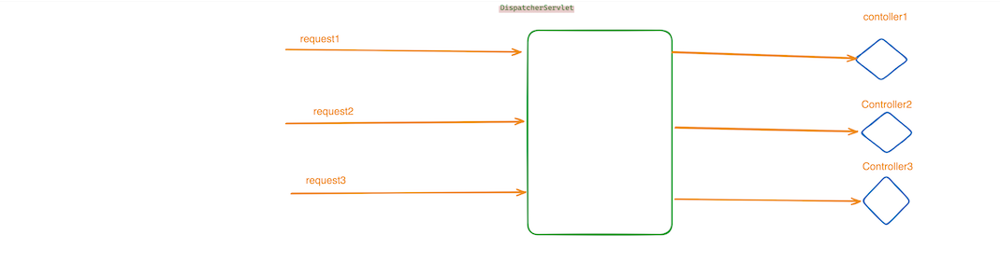
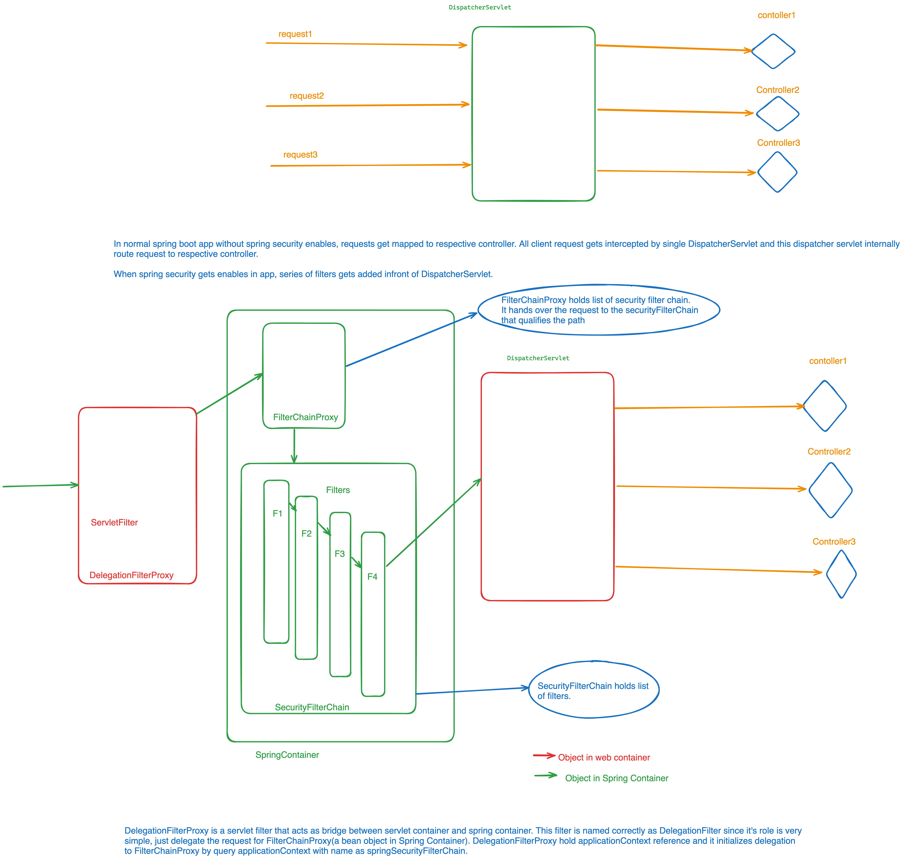

# Table of Contents:
1. [Architecture](#spring-security-architecture)
2. [Csrf Attack](#csrf-attack)
3. [Authentication](#authentication)

### Spring Security Architecture
 To understand Spring Security works in Web-Application, it is important to understand how Web-Application
typically works.

In typical Web-application(Spring Boot), there is a DispatcherServlet that receives all incoming requests  first
and then dispatch the requests to specified handler Controller.

 

Spring boot Web app with spring security enabled adds series of filters in-front of dispatcher servlet.All incoming
requests have to go through these filters before it reaches to DispatcherServlet. Few of the important filters are as :

* DelegationFilterProxy
* FilterChainProxy
* CsrfFilter
* SecurityContextPersistentFilter
* AuthenticationFilter


```DelegationFilterProxy``` is one the first servlet filter that intercepts requests sits inside web-container. Others filters such as
`CsrfFilter, SecurityContextPersitentFilter, AuthenticationFilter` that does the most of security related task
are spring bean residing inside Spring Container. Incoming request must has to be handed over
to these Spring managed bean filter in order to get security related task done.This is exactly what `DelegationFilterProxy` does. It intercepts requests and hands over to
one the Spring managed Filter bean called `FilterChainProxy`. <br>

*How `DelegationFilterProxy` gets reference of FilterChainProxy?* </br>
`DelegationFilterProxy`  keeps a reference of `applicationContext` that gets initialized during startup. `DelegationFilterProxy`
query for a bean with name as `springSecurityFilterChain` from applicationContext and gets `FilterChainProxy`.</br>

FilterChainProxy hold list of `SecurityFilterChain` and picks one of the securityFilter that matches the requests. Each SecurityFilterChain
has series of filters and it request mather function that return true of false. FilterChainProxy uses this matcher function
to pick the SecurityFilterChain.

* How `SecurtyFilterChain` gets initialized? </br>
 We write a configurationFile that return SecurityFilterChain.<br>

```java
import org.springframework.context.annotation.Bean;
import org.springframework.context.annotation.Configuration;
import org.springframework.security.authentication.AuthenticationProvider;
import org.springframework.security.config.annotation.web.builders.HttpSecurity;
import org.springframework.security.config.annotation.web.configuration.EnableWebSecurity;
import org.springframework.security.web.SecurityFilterChain;

@Configuration
@EnableWebSecurity
class WebSecurityConfig {

 private final AuthenticationProvider authenticationProvider1;
 private final AuthenticationProvider authenticationProvider2;
 

 @Bean

 SecurityFilterChain securityFilterChain1(HttpSecurity httpSecurity) {

  return httpSecurity
          .csrf().disable()
          .authorizeRequests(customizer -> customizer.requestMatchers('path1').fullyAuthenticated())
          .authenticationProvider(this.authenticationProvider1)
          .formLogin()
          .and().build();
 }

 @Bean
 SecurityFilterChain securityFilterChain2(HttpSecurity httpSecurity) {
  return httpSecurity.authorizeRequests(customizer -> customizer.requestMatchers("/path2").fullyAuthenticated())
          .authenticationProvider(this.authenticationProvider2)
          .formLogin()
          .and().build();
 }
}
```

With above configuration, `FilterChainProxy` registers securityFilterChain1 and securityFilterChain2 for path1 and path2 respectively.



### Csrf Attack
Cross Site Request Forgery: It is a kind of attack where attackers creates a link for target server and present this link
to users by different ways like emails or creating an embedded link behind images etc on malicious site and user click these link.

Attackers utilizes one of property of how browser works. Typically, when browser makes a requests to server, it
attaches it's cookie automatically in the request. Attackers all have to do is to create proper link. The moment user clicks
on the link browser automatically attaches domain's cookie to the requests

`<img src=www.bank.org?transfer=500&account=1234`

Browser make http request to bank.org with query parameters and attches cookie of bank.org. Generally, cookie contains
authentication token etc that's why server thinks it's valid authenticated request and let it go.

Conditions for Csrf attack to happen: 
* Users must have active session opened in the browsers and server has not taken any preventive measure to counter this.
* Csrf attack won't happen in mobile app.

### Authentication
